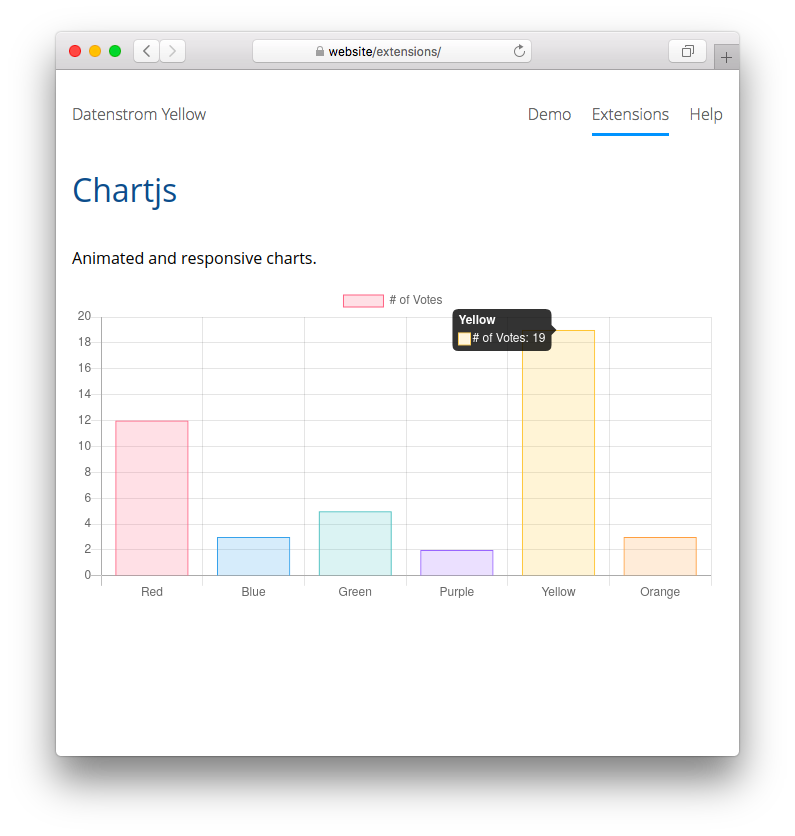

# Chartjs 0.9.1

Animated and responsive charts.

<p align="center"></p>

## How to install an extension

[Download ZIP file](https://github.com/GiovanniSalmeri/yellow-chartjs/archive/refs/heads/main.zip) and copy it into your `system/extensions` folder. [Learn more about extensions](https://github.com/annaesvensson/yellow-update).

## How to show a chart

[Chartjs](https://www.chartjs.org/) is a graphic engine that allows to define a chart in JavaScript Object Literal notation. 

Insert the data translated in JSON with a code block. Wrap the data in \`\`\` and add the language identifier `chartjs`.

Add to the `options` a setting `"canvasDimensions": [width, height]` and set `"responsive": false` if you want to assign a fixed dimension to the chart.

## How to translate JavaScript Object Literal notation in JSON

JavaScript Object Literal notation in JSON are almost identical, but the syntax of JSON is stricter:

+ there are only double quotes `"`
+ keys must be always quoted
+ comments (`//` or `/* */`) are not allowed.

There are online services (for example [ConvertOnline](https://www.convertonline.io/convert/js-to-json)) which automatically transform JavaScript Object Literal notation into JSON.

## Examples

Showing a chart:

    ``` chartjs
    {
        "type": "bar",
        "data": {
            "labels": ["Red", "Blue", "Yellow", "Green", "Purple", "Orange"],
            "datasets": [{
                "label": "# of Votes",
                "data": [12, 19, 3, 5, 2, 3],
                "backgroundColor": [
                    "rgba(255, 99, 132, 0.2)",
                    "rgba(54, 162, 235, 0.2)",
                    "rgba(255, 206, 86, 0.2)",
                    "rgba(75, 192, 192, 0.2)",
                    "rgba(153, 102, 255, 0.2)",
                    "rgba(255, 159, 64, 0.2)"
                ],
                "borderColor": [
                    "rgba(255, 99, 132, 1)",
                    "rgba(54, 162, 235, 1)",
                    "rgba(255, 206, 86, 1)",
                    "rgba(75, 192, 192, 1)",
                    "rgba(153, 102, 255, 1)",
                    "rgba(255, 159, 64, 1)"
                ],
                "borderWidth": 1
            }]
        },
        "options": {
            "canvasDimensions": [800, 400],
            "responsive": true,
            "scales": {
                "yAxes": [{
                    "ticks": {
                        "beginAtZero": true
                    }
                }]
            }
        }
    }
    ```

## Acknowledgements

This extension includes [Chartjs 3.9.1](https://www.chartjs.org/). Thank you for the good work.

## Developer

Giovanni Salmeri. [Get help](https://datenstrom.se/yellow/help/).
